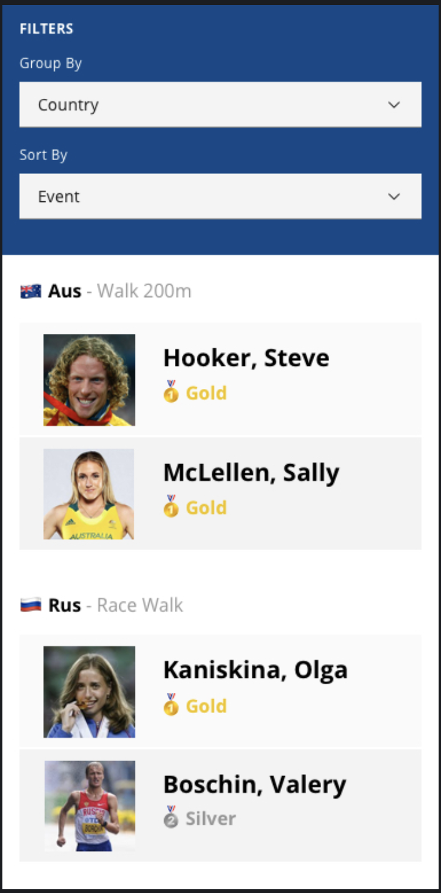

# Athlete Summary App

This is a simple app to allow you to show us your skills

## Getting started

Do a `yarn install` or `npm install`

Start the app with `yarn start` or `npm start`

Run the api with `yarn server` or `npm server`

## Your Task

There is an API available at `/api/athletes` which will return a list of athletes with their result in an event

This data is not returned in the best format.

Your job is to use this data to create a breakdown of the athletes and their results in certain sporting events.

You should:

- List the athletes
- They should be sorted by country and event
- They should be grouped by country
- They should also be sorted by medal

If you have time:

- Implement filtering
- Add some tests for your code

## Designs

Below is the design which is just a guideline for you to follow.

Emojis, images and beautiful styling are nice to haves.

Don't worry too much about them :) 

